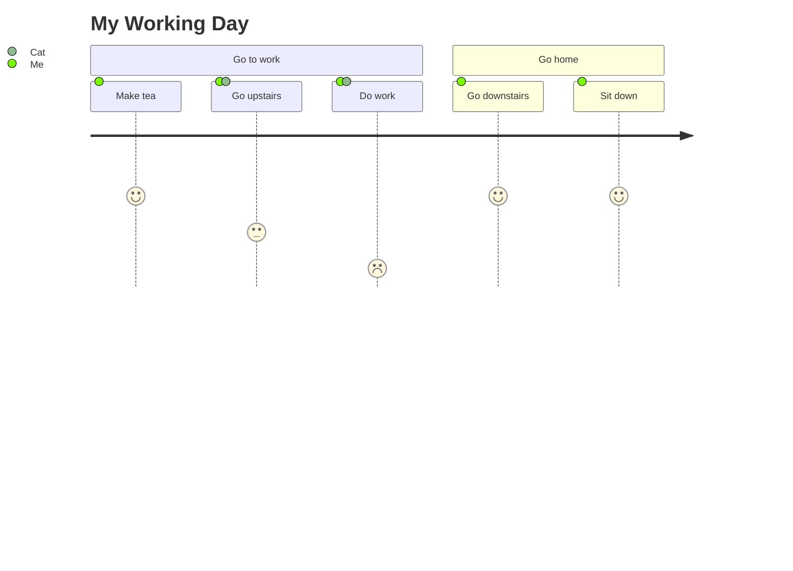

# Phase 10 Design — Journey & Architecture Diagrams

**Date:** 2026-02-15
**Status:** Approved

## Overview

Two diagram types with unique custom layouts. Neither fits Sugiyama or grid; each gets its own positioning logic.

## Journey Diagram

### Syntax



### Elements

- **Title** (optional): `title <text>`
- **Sections**: `section <name>` — group tasks visually
- **Tasks**: `<name>: <score>: <actor1>, <actor2>` — score 1-5, actors optional

### IR Types

```go
type JourneyTask struct {
    Name    string
    Score   int      // 1-5
    Actors  []string
    Section string   // which section this belongs to
}

type JourneySection struct {
    Name  string
    Tasks []string // task indices
}
```

Graph fields:
- `JourneyTitle string`
- `JourneyTasks []*JourneyTask`
- `JourneySections []*JourneySection`

### Layout

Horizontal track diagram:
- Sections are colored bands spanning their tasks
- Tasks are positioned left-to-right within sections
- Score maps to vertical position: score 5 = top, score 1 = bottom
- Actor legend at the bottom with colored dots per actor
- Each task is a rounded rectangle positioned at (x, scoreY)

Layout data:
```go
type JourneyData struct {
    Sections []JourneySectionLayout
    Title    string
    Actors   []JourneyActorLayout
    TrackY   float32 // vertical center of the score track
    TrackH   float32 // height of the score track area
}

type JourneySectionLayout struct {
    Label        string
    X, Y         float32
    Width        float32
    Height       float32
    Color        string
    Tasks        []JourneyTaskLayout
}

type JourneyTaskLayout struct {
    Label  string
    Score  int
    X, Y   float32
    Width  float32
    Height float32
}

type JourneyActorLayout struct {
    Name       string
    ColorIndex int
}
```

### Renderer

- Section background rectangles (colored bands)
- Task rounded rectangles with label and score icon (filled circles)
- Dashed horizontal guidelines for score levels
- Title text centered at top
- Actor legend at bottom

---

## Architecture Diagram

### Syntax

```mermaid
architecture-beta
  group api(cloud)[API]

  service db(database)[Database] in api
  service server(server)[Server] in api

  db:R -- L:server
  server:T --> B:api_gw
```

### Elements

- **Groups**: `group <id>(<icon>)[<label>] (in <parent>)?`
- **Services**: `service <id>(<icon>)[<label>] (in <parent>)?`
- **Junctions**: `junction <id> (in <parent>)?`
- **Edges**: `<id>:<side> <arrow> <side>:<id>` where side is L/R/T/B, arrow is `--`, `-->`, `<--`, `<-->`

### IR Types

```go
type ArchSide int // L, R, T, B

type ArchService struct {
    ID      string
    Label   string
    Icon    string
    GroupID string // empty if top-level
}

type ArchGroup struct {
    ID       string
    Label    string
    Icon     string
    ParentID string // for nested groups
    Children []string // service/junction IDs
}

type ArchJunction struct {
    ID      string
    GroupID string
}

type ArchEdge struct {
    FromID   string
    FromSide ArchSide
    ToID     string
    ToSide   ArchSide
    ArrowLeft  bool // <
    ArrowRight bool // >
}
```

Graph fields:
- `ArchServices []*ArchService`
- `ArchGroups []*ArchGroup`
- `ArchJunctions []*ArchJunction`
- `ArchEdges []*ArchEdge`

### Layout

Constraint-based grid placement using directional edge hints:
1. Build adjacency from edges with directional info (L/R/T/B)
2. Place first service at (0,0) in grid coordinates
3. BFS outward: if A:R -- L:B, place B one column right of A
4. After grid assignment, convert to pixel coordinates
5. Groups computed as bounding rectangles of their children + padding

Layout data:
```go
type ArchitectureData struct {
    Groups    []ArchGroupLayout
    Junctions []ArchJunctionLayout
}

type ArchGroupLayout struct {
    ID     string
    Label  string
    Icon   string
    X, Y   float32
    Width  float32
    Height float32
}

type ArchJunctionLayout struct {
    ID   string
    X, Y float32
    Size float32
}
```

Services use the standard NodeLayout map. Edges use EdgeLayout with L/R/T/B anchor points computed from node boundaries.

### Renderer

- Groups as rounded rectangles with icon + label header
- Services as rounded rectangles with icon centered above label
- Junctions as small filled circles
- Edges as straight lines between anchor points on specified sides
- Built-in icons: cloud, database, disk, internet, server (rendered as simple SVG shapes)

---

## Config

```go
type JourneyConfig struct {
    TaskWidth   float32 // 120
    TaskHeight  float32 // 50
    TaskSpacing float32 // 20
    TrackHeight float32 // 200 - vertical range for scores 1-5
    SectionGap  float32 // 10
    PaddingX    float32 // 30
    PaddingY    float32 // 40
}

type ArchitectureConfig struct {
    ServiceWidth  float32 // 120
    ServiceHeight float32 // 80
    GroupPadding  float32 // 30
    JunctionSize  float32 // 10
    ColumnGap     float32 // 60
    RowGap        float32 // 60
    PaddingX      float32 // 30
    PaddingY      float32 // 30
}
```

## Theme

Journey colors:
- `JourneySectionColors []string` — cycling section fill colors
- `JourneyTaskFill`, `JourneyTaskBorder`, `JourneyTaskText`
- `JourneyScoreColors [5]string` — score 1-5 indicator colors (red to green)

Architecture colors:
- `ArchServiceFill`, `ArchServiceBorder`, `ArchServiceText`
- `ArchGroupFill`, `ArchGroupBorder`, `ArchGroupText`
- `ArchEdgeColor`
- `ArchJunctionFill`
